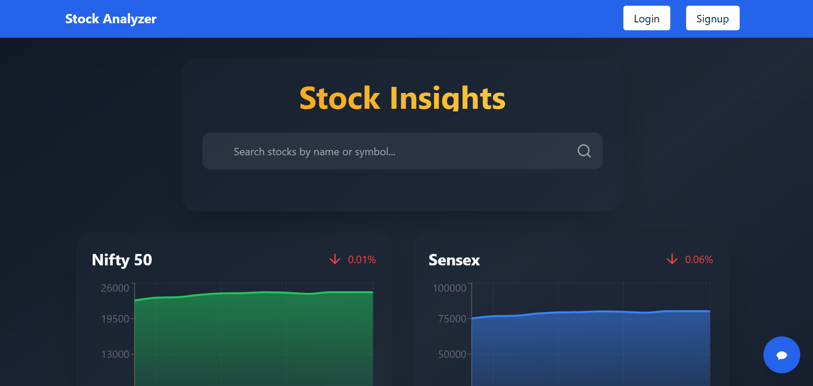
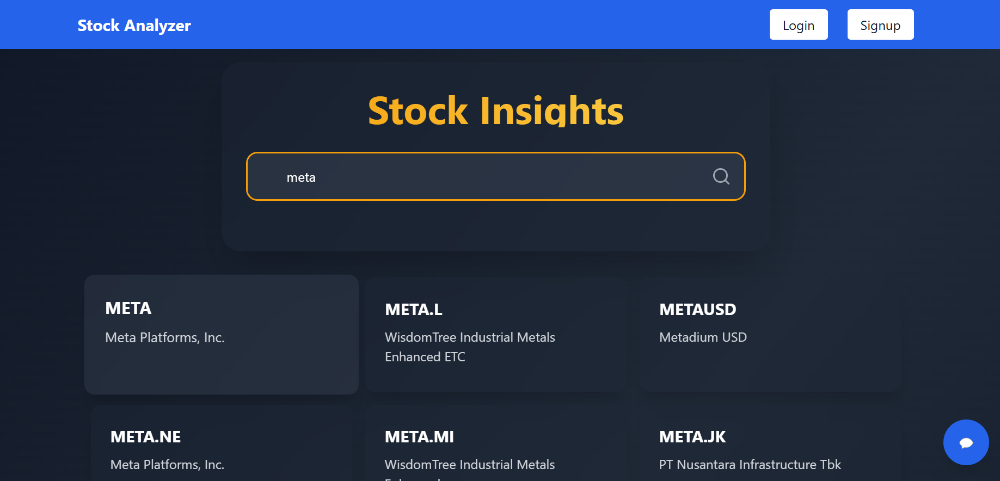
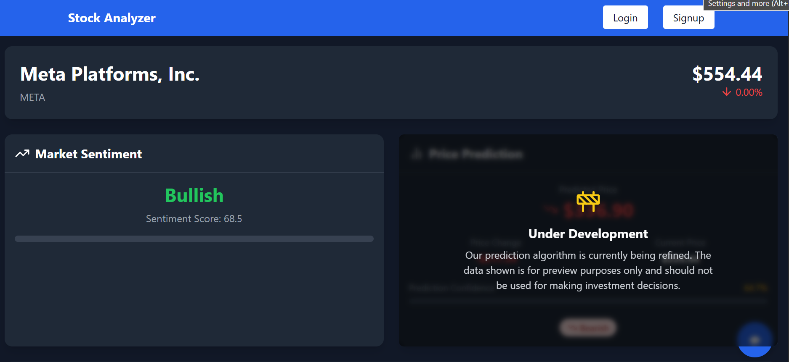
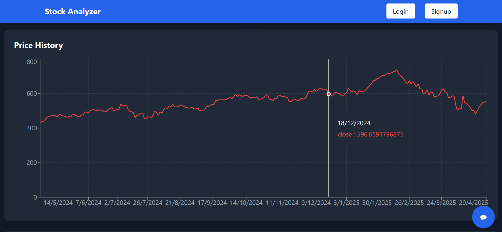
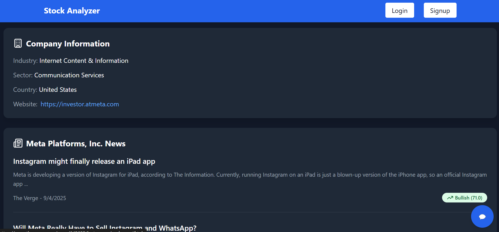
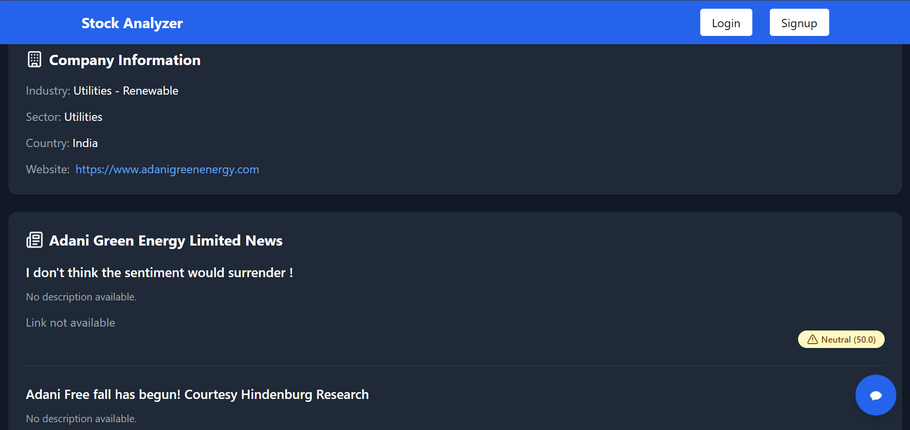
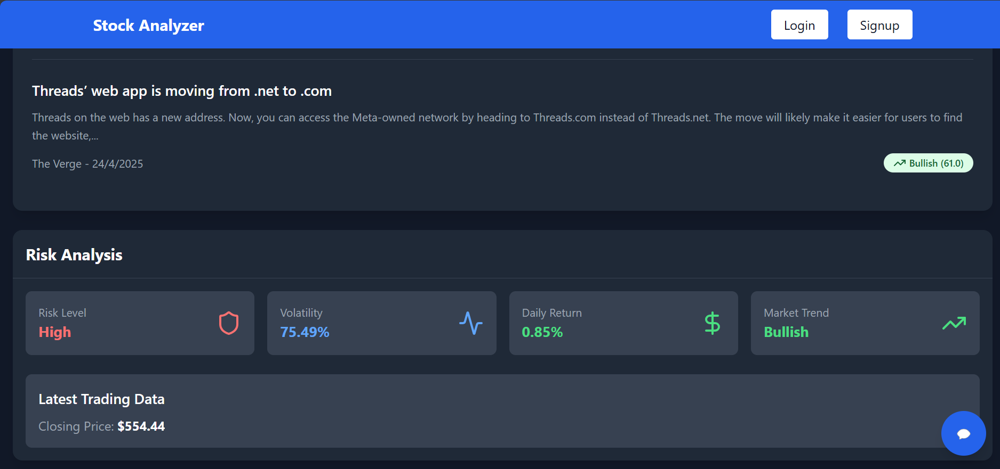

# AI-Based Stock Trading for Indian Markets

## Project Overview
This project leverages AI and advanced analytical techniques to enhance stock trading strategies for Indian stocks listed on NSE and BSE. It combines sentiment analysis, price prediction, technical indicators, and chatbot recommendations to enable informed intraday and swing trading decisions.


# Homepage
A sleek, responsive dashboard displaying real-time market indices (Nifty 50 and Sensex) with visual trend graphs and percentage changes, complemented by an intuitive search bar for effortless stock discovery.

Search Functionality
Advanced search system delivering instant results across multiple markets, displaying relevant stock symbols with their associated companies and providing seamless navigation to detailed analysis pages.


Stock Detail View
Comprehensive stock overview presenting current price, percentage change, and market sentiment analysis with numerical scoring, enhanced by visual indicators for at-a-glance performance assessment.


Price History Analysis
Interactive historical price charting spanning multiple months with precision data points, enabling users to track stock performance over time with specific date and price information on hover.


Company Information
Detailed company profiles featuring industry classification, sector categorization, country of operation, and official website links for thorough fundamental analysis and research.


News Integration
Curated company-specific news feed with sentiment analysis, publication details, and relevance indicators to keep investors informed of market-moving developments and media coverage.


Risk Assessment
Sophisticated risk analysis framework providing volatility metrics, return calculations, market trend indicators, and overall risk level determination for informed investment decision-making.


## Features

### Sentiment Analysis
- **News Sentiment Analysis**: Analyzes real-time news to derive sentiment scores for stocks listed in NSE and BSE.
- **Global and Indian Market Trends**: Performs sentiment analysis on global and domestic market trends to assess market behavior.

### Price Prediction
- **LSTM Forecasting**: Utilizes LSTM models for accurate price predictions, aiding traders in making data-driven decisions.

### Trend and Risk Assessment
- **RFA (Random Forest Algorithm)**: Evaluates market trends and assesses risk levels, enabling strategic decision-making.

### Buy/Sell Recommendations
- **Technical Indicators**: Generates buy/sell tickers for both intraday and swing trading strategies using advanced technical indicators.

### Recommendation Justification
- **RAG-Based Chatbot**: Implements a Retrieval-Augmented Generation chatbot to provide recommendation justifications and trading summaries, ensuring transparency and confidence in decisions.

## Installation
1. **Clone the Repository**:
   ```bash
   git clone https://github.com/ShamanthHiremath/Enigma_24.git
   ```
2. **Navigate to the Project Directory**:
   ```bash
   cd 
   ```
3. **Install Dependencies**:
   ```bash
   pip install -r requirements.txt
   ```
4. **Set Up API Keys**:
   - Obtain API keys for necessary services (e.g., news sentiment analysis, stock data).
   - Add them to the `.env` file in the project directory.

## Usage
1. **Run the Application**:
   ```bash
   python main.py
   ```
2. **Interact with the Chatbot**:
   Use the chatbot interface for real-time recommendations and justifications.
3. **View Buy/Sell Recommendations**:
   Access generated tickers and sentiment scores from the dashboard.

## Technologies Used
- **Machine Learning**: Random Forest, LSTM
- **Natural Language Processing**: Sentiment Analysis
- **Technical Indicators**: RSI, MACD, Bollinger Bands, EMA, etc.
- **Chatbot Framework**: Retrieval-Augmented Generation (RAG)

## Future Enhancements
- **Integration with Trading Platforms**: Automate trades based on AI-generated recommendations.
- **Multi-Market Support**: Expand coverage to global markets.
- **Enhanced Sentiment Sources**: Incorporate social media analysis.

## Contributing
Contributions are welcome! Please follow these steps:
1. Fork the repository.
2. Create a feature branch (`git checkout -b feature-name`).
3. Commit your changes (`git commit -m 'Add feature-name'`).
4. Push to the branch (`git push origin feature-name`).
5. Create a pull request.

## License
This project is licensed under the MIT License. See the [LICENSE](LICENSE) file for details.

## Contact
For queries or feedback, please reach out:
- **Email**: your-email@example.com
- **LinkedIn**: [Shamanth M Hiremath](https://linkedin.com/in/shamanthmhiremath)
- **GitHub**: [Shamanth Hiremath](https://github.com/ShamanthHiremath)

---
**Happy Trading!** 📈
